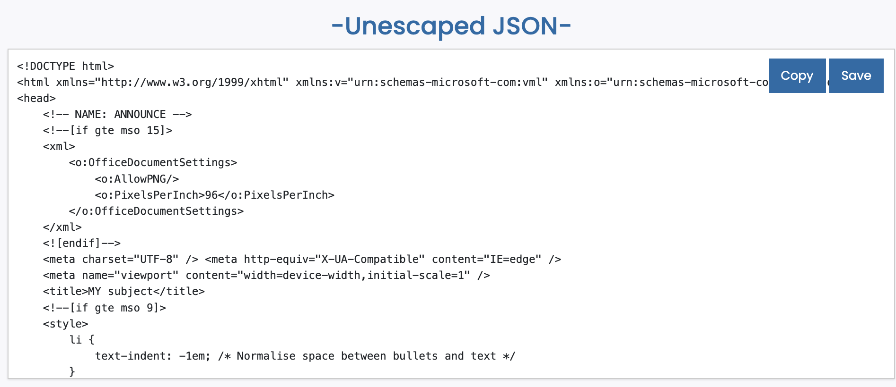
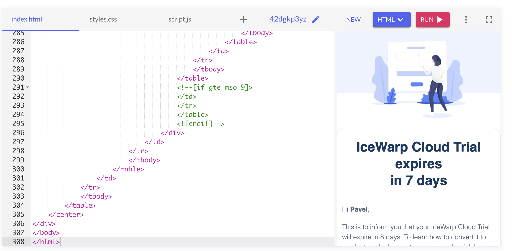
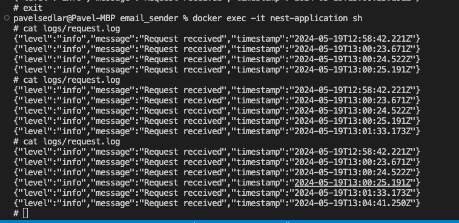

# Email Sender

<details>
  <summary>Table of Contents</summary>
  <ol>
    <li>
      <a href="#about-the-project">About The Project</a>
      <ul>
        <li><a href="#built-with">Built With</a></li>
      </ul>
    </li>
    <li>
      <a href="#getting-started">Getting Started</a>
      <ul>
        <li><a href="#prerequisites">Prerequisites</a></li>
        <li><a href="#installation">Installation</a></li>
      </ul>
    </li>
    <li>
      <a href="#project-routes">Project routes</a>
      <ul>
        <li><a href="#get-authtoken">GET auth/token</a></li>
        <li><a href="#post-email">POST email</a></li>
      </ul>
    </li>
    <li>
      <a href="#added-features">Added features</a>
      <ul>
        <li><a href="#rate-limiting">Rate limiting</a></li>
      </ul>
    </li>
    <li>
      <a href="#suggestions-before-production">Suggestions before production</a>
    </li>
    <li><a href="#author">Author</a></li>
  </ol>
</details>

## About The Project

This project is part of a technical round. Project demonstrates sending emails to a queue and processing them immediately or with a delay according to UTC date and time.

### Built with

- Visual Studio Code
- NodeJS v18.16.0
- NestJS 10.2.0
- Redis
- Docker 25.0.3
- Postman

### Getting started

#### Prerequisities

- Docker version 25.0.3

#### Installation

1. Create `.env` file and fill it with variables (variable names are included in `.env.example` file ). 
2. Start Docker, if you do not have it started
3. Open terminal
4. Run command `docker compose up --build`

After these steps you should have two containers. You can check them in Docker desktop.


For stopping project simply press `ctrl + c` in terminal.

### Project routes

#### GET auth/token

This route serves to obtain a JWT token for Bearer authentication, which is needed in another route. Expiration time depends on variable _JWT_TOKEN_EXPIRATION_TIME_ in `.env` time. In case of missing variable expiration time is set on 1 hour.

#### POST email

After successful authentication, the route sends an email with the parameters defined in the request body (JSON object) in `.eml` format to the queue for further processing.

**Body structure:**

- _key_ - name of email template
- _subject_ - email subject
- [optional] _delayed_send_ - When filled, email sending is supposed to be postponed till specified time (UTC). When missing (or filled with date older than current date and time), email is supposed to be sent immediately. 
- _body_data_
   - _name_ - name of the recipient
   - _days_ - number of days till expiration
   - _link_ - formatted hyperlink object used in email body
       - _label_ - label of formatted link
       - _url_ - url
- _email_ - array of target email addresses (duplicate emails will be removed)
- _bcc_ - array of hidden copy email addresses (duplicate emails will be removed)

_Note:_ You can use a defined collection `postman/email_sender.postman_collection.json` to import into Postman.

For better readability, I decided to edit the "template" `taks-icewarp.eml` file to keep as close as possible to the original email.

Result is returned as JSON object (which is added also to queue) and status code. This object is not `.eml` file, but contains all necessary data for further usage.

```json
{
    "from": "sender@bar.com",
    "to": [
        "something@neco.cz"
    ],
    "bcc": [
        "neco@email.cz"
    ],
    "subject": "MY subject",
    "text": "body_text",
    "html": "body_html"
}
```

_Note:_ In postman you can see also "escape characters" in `text` and `html` properties. For checking, if email body is correct, I used WYSIWYG editor.

Steps:
1. Copy text from `html` property and paste it into text field on [this page](https://www.freeformatter.com/json-escape.html)
2. On this page click on "Unescape JSON". You should see body without escape characters.

3. Copy this text and paste into `index.html` file on [this page](https://onecompiler.com/html)
4. After click on "RUN" button you should see, how your email will look.


#### Request log file view

Since application run in Docker container, for showing results in log file you need to check log file in this container.

1. Open terminal
2. Run command `docker exec -it nest-application sh`
3. Run command `cat logs/{{LOGGER_REQUEST_NAME}}.log`. You should see, that request was received with timestamp. Default value of `LOGGER_REQUEST_NAME` is `request`.

4. For exit run command `exit`

### Added features

#### Rate limiting

[Throttler](https://docs.nestjs.com/security/rate-limiting) was used as prevention against brute-force attacks.

Default values of variables in case of missing _THROTTLEL_TTL_ and _THROTTLEL_LIMIT_ in `.env` file are:

- `ttl` (time to live in milliseconds): 10000 
- `limit` (maximum number of requests within the ttl): 10

### Suggestions before production

#### Brute-force attacks prevention

  There may be a possibility of a brute-force attack(s), when large amount of reuest could be sent at once (emails to be send immediatelly).

  In my opinion there are several ways to solve the problem:

  1. Update rate limiting per request
  2. Running multiple servers

#### Brute-force attack with delayed_send

  There may be another possibility of a brute-force attack(s), when theoretically the queue can be overwhelmed with emails to be sent later (for example year later from current date and time, when request was sent).

  A **theoretical solution** could be to store emails intended for later send to the database table and their later addition into queue

  Possible table (named _delayed_send_emails_ for example) structure:

- id
- eml_data
- delayed_send - UTC datetime, when email should be sent
- processed - column for check, if email was sent to queue

**Use case scenario**

1. User will send email with `delayed_send` set on **2 days later** (or with different delay) from current date
2. **Only** emails for immediate sending or those to be sent on the same day or next day when the request was created will be in queue.
3. In this case email from (1) will be added into table for **later processing**.

There may be implemented [Cron job](https://docs.nestjs.com/techniques/task-scheduling), which will for example every midnight:

1. Get emails from _delayed_send_emails_, which are needed to be processed **max for next day and are not processed yet** (or similar condition).
2. These emails will be **added to queue** for process.


After succesfull processed job, column _processed_ will be set to true, so cron will not take them next day.

#### Configuration of rate limiting

So that the application is not overloaded, a sufficient rate limit should be set or several servers should be started. I would probably determine these values based on stress tests.

#### Monitoring

In CloudTalk we used datadog to monitor errors or to determine which SQL queries were slow, etc. I would definitely consider to implement it.

#### Better authentication

In addition to checking the expiration of the token, I would also check whether the user initiating the request exists (by _email_ in password for example). In this case there should be new table in database _users_.

### Author

- Name: **Pavel Sedlář**
- <a href="https://www.linkedin.com/in/pavel-sedl%C3%A1%C5%99-574039117/">LinkedIn Profile</a>
- <a href="https://github.com/pauwelcz/email_sender">Github repository</a>