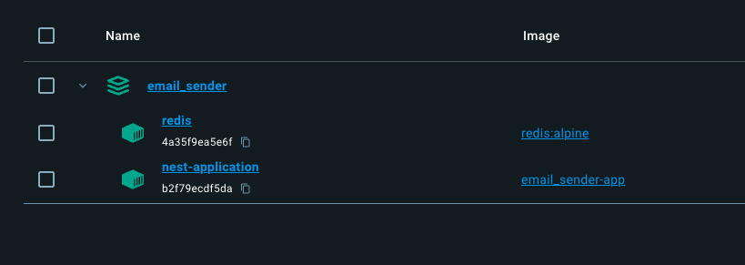

# Email Sender

  
Table of Contents

  <ol>
    <li>
      <a href="#about-the-project">About The Project</a>
      <ul>
        <li><a href="#built-with">Built With</a></li>
      </ul>
    </li>
    <li>
      <a href="#getting-started">Getting Started</a>
      <ul>
        <li><a href="#prerequisites">Prerequisites</a></li>
        <li><a href="#installation">Installation</a></li>
      </ul>
    </li>
    <li>
      <a href="#project-routes">Project routes</a>
      <ul>
        <li><a href="#get-authtoken">GET auth/token</a></li>
        <li><a href="#post-email">POST email</a></li>
      </ul>
    </li>
    <li>
      <a href="#added-features">Added features</a>
      <ul>
        <li><a href="#rate-limiting">Rate limiting</a></li>
      </ul>
    </li>
    <li>
      <a href="#suggestions-before-production">Suggestions before production</a>
    </li>
    <li><a href="#author">Author</a></li>
  </ol>

## About The Project

This project is part of a technical round. Project demonstrates sending emails to a queue either immediately or with a delay according to UTC date and time.

### Built with

- Visual Studio Code
- NestJS
- Redis
- Docker
- Postman

### Getting started

#### Prerequisities

- docker version 25.0.3

#### Installation

1. Create `.env` file and fill it with variables (variable names are included in `.env.example` file ). 
2. Start Docker, if you do not have it started
3. Open terminal
4. Run command `docker compose up --build`

After these steps you should have two containers. You can check them in Docker desktop.

For stopping project simply press `ctrl + c` in terminal.

### Project routes

#### GET auth/token

This route serves to obtain a JWT token for Bearer authentication, which is needed in another route. Expiration time depends on variable _JWT_TOKEN_EXPIRATION_TIME_ in `.env` time. In case of missing variable expiration time is set on 1 hour.

#### POST email

After successful authentication, the route sends an email with the parameters defined in the request body (JSON object) in `.eml` format to the queue for further processing.

**Body structure:**

- _key_ - name of email template
- _subject_ - email subject
- [optional] _delayed_send_ - When filled, email sending is supposed to be postponed till specified time (UTC). When missing (or filled with date older than current date and time), email is supposed to be sent immediately. 
- _body_data_
   - _name_ - name of the recipient
   - _days_ - number of days till expiration
   - _link_ - formatted hyperlink object used in email body
       - _label_ - label of formatted link
       - _url_ - url
- _email_ - array of target email addresses (duplicate emails will be removed)
- _bcc_ - array of hidden copy email addresses (duplicate emails will be removed)

_Note:_ You can use a defined collection `postman/email_sender.postman_collection.json` to import into Postman.

### Added features

#### Rate limiting

### Suggestions before production

### Author

- Name: **Pavel Sedlář**
- <a href="https://www.linkedin.com/in/pavel-sedl%C3%A1%C5%99-574039117/">LinkedIn Profile</a>
- <a href="https://github.com/pauwelcz/email_sender">Github repository</a>